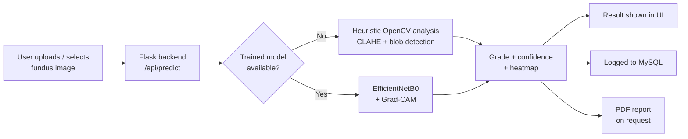

# 👁️ Retina Guard AI

**Intelligent retinal screening for early diabetic retinopathy (DR) detection.**


Retina Guard AI analyzes a fundus (retina) photograph and grades it for
signs of diabetic retinopathy — No DR, Mild, Moderate, Severe, or
Proliferative — with a visual heatmap of the flagged regions, a
confidence score, and a downloadable PDF report. Built as a college
capstone project.

> ⚠️ **Screening aid only — not a medical diagnosis.** Always consult a
> qualified ophthalmologist.

---

## 📸 Screenshots

| Upload & Analyze | Result with Heatmap |
|---|---|
| *(add a screenshot of the upload screen here)* | *(add a screenshot of the result screen here)* |

> Replace this section with real screenshots once you run the app —
> drop PNGs into a `screenshots/` folder and reference them here, e.g.
> ``.

---

## 🧠 How it works



Two analysis modes, selected automatically — **no code changes needed**
to switch between them:

| Mode | When it runs | How it works |
|---|---|---|
| **Heuristic demo** (default) | No trained model file present | Classic OpenCV pipeline: CLAHE contrast enhancement on the green channel, then dark/bright blob detection to flag lesion-like regions |
| **Trained model** | After you run `model_training/train_model.py` on a real dataset | EfficientNetB0 (transfer learning) + real Grad-CAM explainability heatmaps |

This means the project **runs and demos end-to-end immediately**, with
no dataset, GPU, or internet connection required — and can be upgraded
to a real trained classifier later without touching the frontend or API.

---

## 🛠️ Tech stack

- **Frontend:** HTML + CSS + Bootstrap 5 + vanilla JavaScript (no build step)
- **Backend:** Python Flask
- **Image processing:** OpenCV
- **AI:** Transfer learning on EfficientNetB0 (TensorFlow/Keras) + Grad-CAM
- **Database:** MySQL (optional — app runs fine without it)
- **PDF reports:** ReportLab

---

## 🚀 Quick start

```bash
git clone https://github.com/<your-username>/RetinaGuardAI.git
cd RetinaGuardAI/backend
pip install -r requirements.txt
python app.py
```

Open **http://localhost:5000**. Click a sample image or upload your own
fundus photo, then **Analyze Image**.

`sample_images/` ships with 5 synthetically generated demo fundus
images (No DR → Proliferative) so the gallery works out of the box.
See `sample_images/generate_samples.py`.

---

## 🧪 Training a real model (optional)

1. Download a public DR dataset — [APTOS 2019](https://www.kaggle.com/c/aptos2019-blindness-detection) or [EyePACS](https://www.kaggle.com/c/diabetic-retinopathy-detection) (Kaggle).
2. Organize it into:
   ```
   dataset/train/0_No_DR/...
   dataset/train/1_Mild/...
   dataset/train/2_Moderate/...
   dataset/train/3_Severe/...
   dataset/train/4_Proliferative_DR/...
   dataset/val/...   (same structure)
   ```
3. Train:
   ```bash
   cd model_training
   pip install -r requirements.txt
   python train_model.py --data_dir ./dataset --epochs 15
   ```
4. This writes `model/retina_model.h5`. Restart the Flask server — it
   auto-detects the file and switches to real inference with **Grad-CAM**
   heatmaps (`backend/grad_cam.py`) instead of the OpenCV blob overlay.

---

## 🗄️ Enabling MySQL history logging (optional)

`backend/db.py` fails soft — if MySQL isn't set up, the app just skips
logging and keeps working.

```bash
mysql -u root -p < backend/schema.sql
```

Then set your credentials as environment variables:

```bash
export DB_HOST=localhost
export DB_USER=root
export DB_PASSWORD=yourpassword
export DB_NAME=retina_guard
```

Every prediction is now saved to the `predictions` table. View it at
**http://localhost:5000/history**, or fetch `GET /api/history` directly.

---

## 📄 PDF reports

Click **Download PDF Report** after any analysis to get a one-page
report (image, heatmap, grade, confidence, advice) — built with
ReportLab, no external tools required.

---

## 📁 Project structure

```
RetinaGuardAI/
├── backend/
│   ├── app.py              Flask server + routes
│   ├── analyzer.py          Core analysis (heuristic OpenCV + trained-model path)
│   ├── grad_cam.py            Grad-CAM explainability for the trained model
│   ├── report.py               PDF report generation (ReportLab)
│   ├── db.py                    MySQL history logging (optional, fails soft)
│   ├── schema.sql                 MySQL table definition
│   └── requirements.txt
├── frontend/
│   ├── index.html            Bootstrap UI
│   ├── history.html            Screening history page
│   ├── style.css
│   └── script.js                 Upload / gallery / fetch() calls / render results
├── sample_images/
│   ├── generate_samples.py     Regenerate the demo gallery images
│   └── sample_*.jpg
├── model_training/
│   ├── train_model.py          EfficientNetB0 transfer learning (Keras)
│   └── requirements.txt
├── model/                        (created after training — holds retina_model.h5)
├── LICENSE
└── README.md
```

---

## 🗺️ Roadmap

- [x] Heuristic OpenCV screening (works with no dataset)
- [x] EfficientNetB0 training script
- [x] Grad-CAM explainability
- [x] PDF report export
- [x] MySQL history logging + history page
- [ ] Admin dashboard with grade-distribution charts
- [ ] Image-quality check (reject blurry/dark uploads before analysis)
- [ ] Multi-language UI (English/Kannada)
- [ ] Auth-protected admin view

---

## ⚠️ Disclaimer

This project is a screening aid / academic demo. It must not be used
for real clinical decisions. Always consult a qualified ophthalmologist.

## 📜 License

MIT — see [LICENSE](LICENSE).
